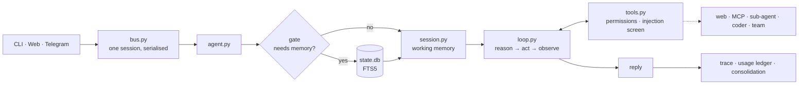

# pocket-agent

**Your own assistant. On your laptop. One mechanism per file, and a test for each one.**

[](https://github.com/Jobfromearth/pocket-agent/actions/workflows/ci.yml)
&nbsp;[**中文**](README_CN.md)

I wanted an assistant that remembers my life and runs on my own machine — not a product I
rent, and not a framework that hides the interesting parts behind three layers of
abstraction. So I wrote the smallest thing that still has every part a serious agent needs,
and kept every part readable: **one mechanism, one file.**

The demo, the eval suite and the MCP round trip all run **with no API key and no network**,
so you can watch it work ten seconds after cloning.

```bash
python -m pocket demo        # a scripted tour: memory, the gate, triage, a real tool call
python -m pocket eval        # 125 deterministic checks, offline, in under a second
python -m pocket dashboard   # a browser door on 127.0.0.1:7777, sharing one bus with this terminal
python -m pocket mcp         # start an MCP server and call a tool through it, no model involved
python -m pocket team        # three workers over one board: two in parallel, one that waits
python -m pocket             # chat for real (put a key in .env)
```

## One turn



## What's inside

| Pillar | Files | What lives there |
|---|---|---|
| **Harness** | `config` `session` `agent` `__main__` `hooks` | working memory, wiring, five moments a hook may interrupt |
| **Doors** | `bus` `dashboard` `telegram` | terminal, browser and chat, converging on one serialised session |
| **Loop** | `loop` `models` `tools` | reason→act→observe with two guardrails; two wire formats behind one loop |
| **Memory** | `memory` `db` `skills` `dream` | semantic / episodic / procedural, a retrieval gate, a consolidation history you can walk back |
| **Context** | `context` | four steps, cheapest first: offload, fit, react, compact |
| **Reach** | `mcp` `web` `subagent` `coder` | MCP over stdio or HTTP, the open web, a scoped sub-agent, a coding agent out of process |
| **Team** | `team` | several workers over one board, scheduled by their dependencies |
| **Safety** | `permissions` `injection` | deny list, ask-the-human, session grants; untrusted output fenced and escalated |
| **Graph** | `graph` | structure *around* the loop: parallel nodes, code routers, fail-open |
| **Ops** | `trace` `evals` `judge` | JSONL trace, spend ledger, two eval suites, the release gate |

State lives in `.pocket/`: `state.db` (SQLite + FTS5 — memory, calendar, chat log, the team
board and the dream ledger), `MEMORY.md`, `calendar.ics`, `artifacts/`, `workspace/`,
`traces/<date>.jsonl`, `usage.jsonl`, `eval_report.json`. All of it yours to open.

## Decisions worth defending

| | |
|---|---|
| **The retrieval gate** | Most agents query memory every turn. That is slow, and worse: irrelevant memories bias the answer. A cheap model answers one narrow question first — *does this need memory?* — and the decision plus its reason land in the trace. |
| **Everything judge-shaped fails open** | A broken gate retrieves anyway; a broken classifier routes to the full loop; a failed summariser keeps the context it could not compact. A degraded part costs latency — never capability. |
| **The loop has exactly two exits** | The model stops asking for tools, or `max_iterations` is reached and it says so honestly. There is no third way for a turn to end. |
| **Guardrails are constructions, not instructions** | A sub-agent cannot delegate because the name is filtered out of its registry, not because the prompt asks it not to. |
| **Nothing is deleted — and the model can prove it** | Offloaded results sit behind `read_artifact`, compacted turns behind `read_history`, and forgotten facts stay as rows marked `forgotten`. "Nothing is lost" has to be true for the *model*, not just for a human with `sqlite3`. |
| **A plan is data, not a conversation** | A team is keys, tool allow-lists and `needs` — never agents negotiating in free text. The board is a table you can read afterwards. |
| **Two eval suites, never one file** | "Did `create_event` fire with the right arguments?" is a unit test. "Was the reply good?" is a score. And a suite that could not run is `skipped`, never `pass`. |

Four mechanisms get a page of their own, because the reasoning is the interesting part:

- **[Context, in four steps](docs/architecture.md)** — offload, fit, react, compact. The budget
  is checked before *every* model call, and old tool results are shortened **in place**, so a
  `tool_use` can never lose its `tool_result`. Only the last step costs a model call, and only
  the last loses detail; it names `read_history` on the way out.
- **[Skills, in two levels](docs/architecture.md)** — the catalog (name + description) always
  ships; a body arrives as *its own message*, from a keyword matcher or from `read_skill`.
- **[MCP](docs/configuration.md#mcp-servers)** — one protocol, two transports. Written for the
  2026-07-28 stateless revision, with `server/discover` probing and an automatic fallback to
  the legacy handshake. `command` means stdio, `url` means Streamable HTTP.
- **[Injection screening](SECURITY.md)** — untrusted output is classified, **fenced rather than
  dropped**, and a high-risk result arms exactly one escalation: the next tool call asks a
  human even if it normally would not. A rewording defeats the patterns; it does not defeat
  the escalation, because that gates the only thing an injection can want.

## What it actually costs

Numbers a reader can reproduce, not adjectives. The offline rows come from
`scripts/measure.py`; the two A/B rows ran the same turns against `kimi-k2.5` with one
variable changed.

| Mechanism | Measured |
|---|---|
| Skill catalog vs inlining every body (10 skills) | resident prompt **3,022 → 1,010 tokens, −66.6%** |
| A 40KB tool result, offloaded | **40,000 → 763 chars, −98.1%** |
| A 20-turn session over budget, compacted | **14,472 → 3,135 chars, −78.3%** |
| Context governance on vs off, same task | input tokens **13,370 → 2,118, −84.2%** |
| Triage routing a turn away from the loop | **5/8 turns**; ~2 model calls instead of ~4.3, **−53%** |
| Retrieval gate, 12 labelled cases | **recall 100% (zero misses)**, cost-weighted accuracy **0.90** |
| — irrelevant memory injected | **100% → 50%** of the cases that should not retrieve |

Two rows say what they are not. The triage row counts model calls rather than latency,
because it was measured on a rate-limited tier where latency measures the rate limiter. And
the gate's plain accuracy is 75% — the cost-weighted number is higher only because all three
of its mistakes were needless retrievals rather than missed ones, which is the trade the
metric exists to price.

## Honest limits

- `POCKET_PROVIDER=mock` is a **rule-based stub, not a model**. It exists so the demo and the
  suite run offline. Point it at `anthropic`, `openai`, `deepseek` or `kimi` for real answers.
- **`delegate_task` is not a sandbox.** It runs the command in `POCKET_CODER` as you, with
  your files. The gate is `risk="ask"` and a human reading the task first.
- The **address guard is a check, not a pin**: urllib resolves a host again when it connects,
  so a zero-TTL record can answer public for the check and private for the connect.
- **Keyword search (FTS5), not embeddings.** For one person's facts, ranked keyword search is
  fast, local, and inspectable with `sqlite3`.
- MCP covers stdio, Streamable HTTP, `tools/list` and `tools/call`. **Resources and prompts
  are not implemented**; an `input_required` result is refused honestly, not half-answered.
- Only loop calls are priced in `usage.jsonl`. The gate, triage and summariser calls are
  traced but not priced, and `POCKET_TRUST` disarms the injection escalation as well as the
  prompt — [SECURITY.md](SECURITY.md) is the full list.

## Where to read next

| Doc | Read it when |
|---|---|
| [docs/architecture.md](docs/architecture.md) | you want one turn traced end to end, the file map, and the invariants the suite defends |
| [docs/configuration.md](docs/configuration.md) | you are pointing it at a provider, an MCP server, or a coding agent |
| [docs/teams.md](docs/teams.md) | you are using `assign_team`, or choosing between it and `delegate` |
| [SECURITY.md](SECURITY.md) | you want the trust boundaries, and what is deliberately not claimed |
| [AGENTS.md](AGENTS.md) | you are a coding agent working in this repo, or a human in a hurry |

## Provenance

The four-pillar structure and a few core routines are re-implemented and trimmed from
[waku-agent](https://github.com/ShenSeanChen/waku-agent) (MIT) — the full-featured version,
with a dashboard, voice and chat gateways and pluggable memory backends. Two more projects
are read and borrowed from rather than depended on: [nanobot](https://github.com/HKUDS/nanobot)
for the terminal client's `/` commands; [ClawTeam](https://github.com/HKUDS/ClawTeam) for
the board — a plan as data, kanban
states, and the discipline of saying "this did not happen" instead of running a step on
missing input. Neither is a dependency; both are worth reading in full. MIT licensed.
