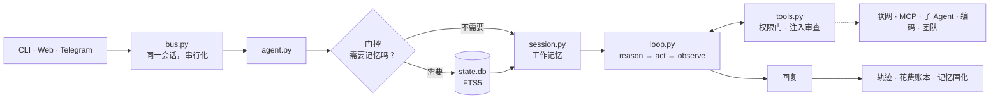

# pocket-agent

**属于你自己的助理。跑在你自己的电脑上。一个机制一个文件，每个都有测试。**

[](https://github.com/Jobfromearth/pocket-agent/actions/workflows/ci.yml)
&nbsp;[**English**](README.md)

我想要一个记得住我的生活、又跑在我自己机器上的助理——不是租来的产品，也不是把最有意思的部分藏在
三层抽象后面的框架。所以我写了「还能称之为严肃 Agent」的最小版本，并且让每一部分都可读：
**一个机制，一个文件，没有一个文件超过 371 行。**

demo、评测套件和 MCP 往返**都不需要 API key、不需要网络**，克隆完十秒就能看到它跑起来。

```bash
python -m pocket demo        # 脚本化巡演：记忆、门控、分诊、一次真实的工具调用
python -m pocket eval        # 126 条确定性评测，离线，一秒内跑完
python -m pocket dashboard   # 浏览器入口 127.0.0.1:7777，与这个终端共用一条消息总线
python -m pocket mcp         # 启一个 MCP server 并真的调一次工具，全程不涉及模型
python -m pocket team        # 三个 worker 共用一块看板：两个并行，一个等依赖
python -m pocket             # 真正对话（在 .env 里放一个 key）
```

`pocket/*.py` 合计 **7,194 行**——其中 5,316 行是机制，1,878 行是证明它没错的评测套件。这个数字
不是装饰：[有一条评测断言它仍然属实](pocket/evals.py)，`./scripts/line_budget.sh` 会按支柱打印。

## 一轮是怎么走的



## 里面有什么

| 支柱 | 文件 | 放的是什么 |
|---|---|---|
| **Harness** | `config` `session` `agent` `__main__` `hooks` | 工作记忆、接线，以及一轮里五个可被 Hook 打断的时刻 |
| **Doors** | `bus` `dashboard` `telegram` | 终端、浏览器、IM，汇聚到一条串行化的会话 |
| **Loop** | `loop` `models` `tools` | reason→act→observe 加两条护栏；一个循环，两种线格式 |
| **Memory** | `memory` `db` `skills` `dream` | 语义 / 情景 / 程序三层，检索门控，可回滚的固化历史 |
| **Context** | `context` | 四级治理，从最便宜的开始：外置、贴合、兜底、压缩 |
| **Reach** | `mcp` `web` `subagent` `coder` | MCP（stdio / HTTP）、开放网络、受限子 Agent、出进程的编码 Agent |
| **Team** | `team` | 多个 worker 共用一块看板，按依赖关系调度 |
| **Safety** | `permissions` `injection` | 拒绝清单、询问人类、会话授权；不可信输出加围栏并升级 |
| **Graph** | `graph` | 循环**之外**的结构：并行节点、代码路由、fail-open |
| **Ops** | `trace` `evals` `judge` | JSONL 轨迹、花费账本、双评测套件、发布门禁 |

状态都在 `.pocket/`：`state.db`（SQLite + FTS5——记忆、日历、聊天记录、团队看板和 dream 账本）、
`MEMORY.md`、`calendar.ics`、`artifacts/`、`workspace/`、`traces/<日期>.jsonl`、`usage.jsonl`、
`eval_report.json`。全部是你能直接打开的文件。

## 值得辩护的决定

| | |
|---|---|
| **检索门控** | 多数 Agent 每轮都查记忆。那不仅慢，而且更糟：不相关的记忆会带偏答案。这里先让便宜模型回答一个很窄的问题——*这条消息需要记忆吗？*——决定和理由都写进轨迹。 |
| **所有「裁判形状」的东西都 fail-open** | 门控坏了照常检索；分诊坏了走完整循环；摘要失败就保留压不掉的上下文。降级只应付出延迟——绝不付出能力。 |
| **循环只有两个出口** | 模型不再要求工具，或达到 `max_iterations` 并如实说出来。没有第三种结束方式。 |
| **护栏是构造出来的，不是嘱咐出来的** | 子 Agent 不能再委派，是因为那个名字被从它的注册表里过滤掉了，不是因为提示词请它别这么做。 |
| **什么都不删——而且模型能验证** | 外置结果在 `read_artifact` 后面，被压缩的对话在 `read_history` 后面，被遗忘的事实仍是标记为 `forgotten` 的行。「什么都没丢」必须**对模型**成立，不能只对拿着 `sqlite3` 的人成立。 |
| **计划是数据，不是对话** | 团队就是 key、工具白名单和 `needs`——不是几个 Agent 用自由文本讨价还价。看板是一张事后能读的表。 |
| **两套评测，永不共处一个文件** | 「`create_event` 是不是带对参数触发了」是单元测试。「回答好不好」是打分。而一个跑不起来的套件是 `skipped`，绝不是 `pass`。 |

有四个机制值得单开一页，因为**推理过程才是有意思的部分**：

- **[上下文四级治理](docs/architecture.md)**——外置、贴合、兜底、压缩。预算在**每一次**模型调用前
  校验，旧工具结果**就地缩短**，所以 `tool_use` 永远不会丢掉它的 `tool_result`。只有最后一级花
  模型调用、也只有最后一级丢细节，而它在离开时写明了 `read_history`。
- **[Skill 两级披露](docs/architecture.md)**——catalog（名字 + 描述）永远随行；正文作为**独立的
  一条消息**到达，来自关键词匹配器或模型自己调的 `read_skill`。
- **[MCP](docs/configuration.md#mcp-servers)**——一个协议，两种传输。按 2026-07-28 无状态修订
  实现，用 `server/discover` 探测并对旧版服务端自动回退握手。`command` 走 stdio，`url` 走
  Streamable HTTP。
- **[注入审查](SECURITY.md)**——不可信输出被分类、**加围栏而不是丢弃**，高风险结果武装**恰好一次**
  升级：下一次工具调用需要人工确认，哪怕它平时不问人。换个措辞能绕开模式匹配，但绕不开升级——
  因为升级卡住的正是一次注入唯一想要的东西。

## 它到底省了多少

可复现的数字，不是形容词。离线那几行来自 `scripts/measure.py`；两组 A/B 用同一批轮次打
`kimi-k2.5`，只改一个变量。

| 机制 | 实测 |
|---|---|
| Skill catalog vs 正文全内联（10 个技能） | 常驻提示 **3,022 → 1,010 token，−66.6%** |
| 40KB 工具结果外置 | **40,000 → 763 字符，−98.1%** |
| 20 轮超预算会话压缩 | **14,472 → 3,135 字符，−78.3%** |
| 上下文治理开 vs 关，同一任务 | 输入 token **13,370 → 2,118，−84.2%** |
| 分诊把一轮路由出循环 | **5/8 轮**；约 2 次模型调用而非约 4.3 次，**−53%** |
| 检索门控，12 条标注用例 | **召回率 100%（零漏检）**，代价加权准确率 **0.90** |
| — 无关记忆注入 | 该跳过的用例里 **100% → 50%** |

其中两行要说清它们不是什么。分诊那行数的是**模型调用次数而非延迟**，因为测它的档位有速率限制，
那里的延迟测的是限速器。门控的**普通准确率是 75%**——加权后更高，只是因为它那三次错误全部是
「多查了一次」而不是「漏了一次」，而给这两种错误定不同的价正是这个指标存在的理由。

## 诚实的边界

- `POCKET_PROVIDER=mock` 是**基于规则的桩，不是模型**。它的存在只为让 demo 和评测离线可跑。
  要真答案请指向 `anthropic`、`openai`、`deepseek` 或 `kimi`。
- **`delegate_task` 不是沙箱。** 它以你的身份、用你的文件运行 `POCKET_CODER` 里的命令。
  闸门是 `risk="ask"` 加上一个先读任务的人。
- **地址守卫是检查，不是钉死**：urllib 在连接时会重新解析域名，所以零 TTL 的记录可以在检查时
  答公网、在连接时答内网。
- **关键词检索（FTS5），不是向量。** 对一个人的事实来说，排序过的关键词检索又快、又本地、
  还能用 `sqlite3` 直接看。
- MCP 覆盖 stdio、Streamable HTTP、`tools/list` 和 `tools/call`。**resources 和 prompts 未实现**；
  遇到 `input_required` 会如实拒绝，而不是含糊地答一半。
- 只有循环里的调用被计价写进 `usage.jsonl`，门控 / 分诊 / 摘要有轨迹但不计价；`POCKET_TRUST`
  除了跳过确认，也会一并解除注入升级——完整清单见 [SECURITY.md](SECURITY.md)。

## 接着读哪里

| 文档 | 什么时候读 |
|---|---|
| [docs/architecture.md](docs/architecture.md) | 想看一轮端到端的走向、文件地图，以及评测守护的那些不变量 |
| [docs/configuration.md](docs/configuration.md) | 你要接 provider、接 MCP server，或接一个编码 Agent |
| [docs/teams.md](docs/teams.md) | 你在用 `assign_team`，或在它和 `delegate` 之间做选择 |
| [SECURITY.md](SECURITY.md) | 你想知道信任边界，以及哪些东西**刻意不声称** |
| [AGENTS.md](AGENTS.md) | 你是在这个仓库里干活的编码 Agent，或者赶时间的人 |

## 出处

四支柱结构和少数核心例程是从 [waku-agent](https://github.com/ShenSeanChen/waku-agent)（MIT）
重新实现并裁剪而来——那是功能完整的版本：仪表盘、语音与聊天网关、可插拔记忆后端。另外两个项目
是读过、致谢并借鉴，而不是依赖：[nanobot](https://github.com/HKUDS/nanobot) 贡献了终端 `/` 命令
的思路，以及「用脚本让 README 里的行数不会烂掉」这个习惯；[ClawTeam](https://github.com/HKUDS/ClawTeam)
贡献了看板——计划是数据、看板状态、以及「宁可说这件事没发生，也不要拿缺失的输入往下跑」这条纪律。
两者都不是依赖，都值得完整读一遍。MIT 许可。
